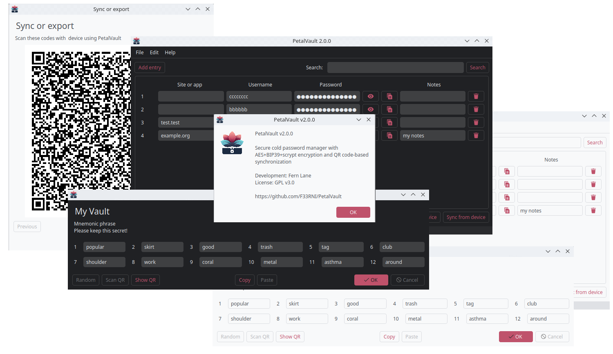

# 🌸 PetalVault

|  | <h1>Secure offline multi-vault password manager with QR code-based synchronization</h1> |
|---------------------------------|:---------------------------------------------------------------------------------------:|



----------

<div style="width:100%;text-align:center;">
    <p align="center">
        
        
        
        
    </p>
</div>

<div style="width:100%;text-align:center;">
    <p align="center">
        <a href="https://github.com/F33RNI/PetalVault-Android"></a>
        <a href="https://github.com/F33RNI/PetalVault/releases/latest"></a>
    </p>
</div>

----------

## 😋 Support Project

> 💜 Please support the project

- BTC: `bc1qaj2ef2jlrt2uafn4kc9cmscuu8yqkjkvxxr5zu`
- ETH: `0x284E6121362ea1C69528eDEdc309fC8b90fA5578`
- ZEC: `t1Jb5tH61zcSTy2QyfsxftUEWHikdSYpPoz`

- Or by my music on [🔷 bandcamp](https://f3rni.bandcamp.com/)

- Or [message me](https://t.me/f33rni) if you would like to donate in other way 💰

----------

## ⚠️ Disclaimer

### PetalVault is under development

> Use at your own risk. The author of the repository is **not** responsible for any damage caused by the repository, the
> application, or its components

----------

## ❓ Getting Started

> PetalVault is a **secure** **offline** password manager with **AES256** + **Scrypt** encryption, **mnemonic phrase**
> as the primary key, and offline synchronization using **QR codes**
>
> PetalVault allows you to create multiple vaults on one device, each protected by different keys. For example, multiple
> people can use one device, or you can use separate vaults for different tasks
>
> Each vault is securely encrypted with a master key derived from **mnemonic phrase (12 words)**. You can
> **scan or show** this phrase using a QR code. Additionally, to simplify access to the vault, you can create
> **your own master password**. In this case, the mnemonic phrase will be encrypted with this password and stored
> in the vault. If you forget the master password, you can restore access to the vault by entering the mnemonic phrase
>
> Each vault can be **exported** and **imported** using **QR codes**. You can also set up
> **synchronization between two devices** to sync only changes, not the entire vault.
> Synchronization can be performed in public places, as the data in QR codes is **securely encrypted**.
> Note that both devices must have the **same mnemonic phrase** since the synchronization key is also derived from it

### 📦 Download and Installation

- To download executable file, go to the
  link <https://github.com/F33RNI/PetalVault/releases/latest> and download the file for your device
- Alternatively, you can build the app yourself. For this, refer to the `🏗️ Launch or Build from Source` section

### 🆕 Creating or Importing a Vault

1. First, create or import a vault. To do this, select `File` > `New Vault` or `File` > `Import Vault`
2. Choose any name for your vault. You can **rename** it later
3. Create a mnemonic phrase or choose a randomly generated one. Write this phrase down **in a secure place** because if
   you lose the master password, you can only restore access to the vault using this mnemonic phrase.
    - **For import**, scan the **QR code** of the mnemonic phrase from another device. Keep in mind that the phrase is
      in plain text, so during the scanning, no one should see the QR code
4. Choose whether you want to save the mnemonic phrase encrypted with your master password. If your password is
   **strong** you can safely use the master password
5. **For import**, scan all QR codes from another device in sequence, after selecting export

### 🔐 Adding Entries

- To add entries, click `Add entry` button. You have 4 fields available: website address (or name for which the password is used),
   username, password, and notes. The data in **all fields are encrypted**, so you can store sensitive data in any of
   them
  - PetalVault also automatically
      **generates a strong password** that you can use for this entry
  - The password field is hidden by default. To show the text, click the `👁️` button on the right

### ✏️ Editing and Deleting Entries

- To edit data of any entry just start typing in it. You will see `Saving...` text in the status bar. PetalVault saves your data automatically
- To delete an entry, click on the `🗑️` button and confirm the deletion

### 🔄 Synchronization and Export

1. Click the `Sync to device`. Choose an existing device or create a new one. This is necessary to
   sync only the changes in the future, not the entire vault
2. On the other device, click `Sync from device` and scan the QR codes
3. If the mnemonic phrases do not match (the master password, unlike the mnemonic phrase, **can differ**), an error will
   occur because the synchronization data is encrypted
4. During the first synchronization, especially if there are many entries, there may be **several** QR codes. Scan them
   all sequentially. If you missed a QR code, you can scan it later, as the **order** of scanning **does not matter**

- To export the vault to a new device (**without creating a device**), select `File` > `Export Vault`. On
  the other device, click `Sync from device` and scan all the QR codes

> ⚠️ For synchronization/import/export, the mnemonic phrase on both devices must be **the same**. However, the master
> password, unlike the mnemonic phrase, **can differ**

### 📝 Editing and Deleting the Vault

- You can **rename the vault**. To do this, select `Edit` > `Rename Vault` and enter a new name
- To **delete the vault**, select `Edit` > `Delete Vault` and confirm the deletion

> ⚠️ For security reasons, the vault can only be deleted after it is decrypted

### 🎨 Theme and Language

- To change theme, select `Edit` > `Theme` > `Light` or `Dark`
- To change language, select `Edit` > `Language` > Your language

----------

## 🏗️ Launch or Build from Source

- Download latest release from <https://github.com/F33RNI/PetalVault/releases/latest>
  - Just launch it

- Launch or build from source

  - Install Python (tested on **3.11** only)
  - Clone repo

      ```shell
      git clone https://github.com/F33RNI/PetalVault
      cd PetalVault
      ```

  - Create virtual environment and install dependencies

      ```shell
      python -m venv venv

      # For Linux
      source venv/bin/activate

      # For Windows
      venv\Scripts\activate.bat

      pip install -r requirements.txt --upgrade
      ```

  - **Launch** PetalVault

      ```shell
      python main.py --verbose
      ```

  - **Build** using PyInstaller

      ```shell
      pip install pyinstaller
      pyinstaller main.spec

      # Executable will be inside dist/ directory
      ```

----------

## ✨ Contribution

- Anyone can contribute! Just create a **pull request**
